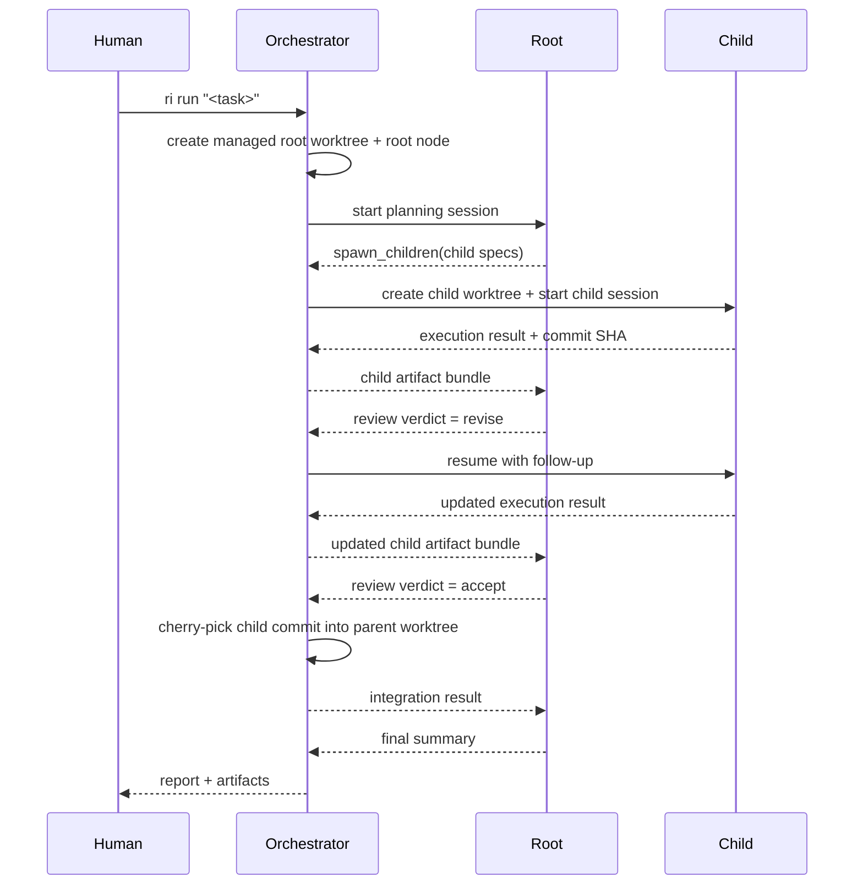

# Design: Recursive Intelligence Claude Runtime

Generated by /office-hours on 2026-03-26
Branch: calmdentist/claude-rec-plan
Status: DRAFT
Mode: Builder

## Problem Statement
Build a local-first runtime that lets Claude Code solve software tasks recursively by spawning fresh Claude workers in child git worktrees, reviewing their output, looping them when needed, and merging accepted work upward. V1 targets Claude only. The main question is whether this improves repo-scale solve rate and cost-normalized performance versus a flat agent.

## What Makes This Cool
- It gives coding agents the same organizational structure strong human engineers use: delegate, review, integrate.
- It converts context bloat into tree-structured memory instead of one long overloaded session.
- It lets the system run competing hypotheses in parallel in isolated worktrees.
- It is benchmarkable because the runtime is explicit, replayable, and leaves room for a later second adapter without driving the V1 design.

## Constraints
- Claude-first now; Codex later via a separate adapter.
- The orchestrator cannot do task reasoning.
- Every node gets its own git worktree derived from its parent's current state.
- Parents control review, merge, and child looping.
- Child sessions must be resumable across turns.
- The runtime must emit artifacts and metrics suitable for benchmarks.
- V1 should stay single-machine and local-first.
- Safety matters: the root talks to the human; children do not.

## Premises
- Anthropic's Agent SDK already exposes Claude Code's tool loop, session resume, permissions, hooks, and the same core tools as Claude Code. That is the right substrate for programmatic control, not PTY automation.
- True recursion should be modeled as separate Claude sessions plus an external orchestrator, not built-in Claude subagents, because each node needs its own worktree, lifecycle, and merge boundary.
- Keep only a thin adapter seam around Claude in V0 and V1. Do not spend real time on multi-provider generalization until the Claude path works end to end.
- The benchmark harness is part of the product, not a follow-up. Otherwise you cannot tell whether recursion is real progress or just a more elaborate demo.

## Approaches Considered

### Approach A: Drive the `claude` CLI in pseudo-terminals
Pros:
- Fastest path to a rough demo
- Mirrors manual Claude Code usage

Cons:
- Brittle parsing
- Weak structured state
- Hard to resume deterministically
- Poor fit for benchmarks
- Messy permission handling
- Creates a worse abstraction boundary for a later Codex adapter

### Approach B: External orchestrator plus Claude Agent SDK sessions
Pros:
- Explicit session IDs
- Hooks, permissions, and budget control
- Clean transcript and artifact capture
- Strong fit for resume and parent wake-up flow
- Cleaner provider boundary for a later Codex adapter

Cons:
- More upfront engineering
- Forces you to define explicit runtime contracts early

## Recommended Approach
Use a Claude-first runtime with a thin adapter seam, built on the Anthropic Agent SDK.

Each runtime node owns:
- one SDK session ID
- one git worktree and branch
- one task spec
- one budget envelope
- zero or more child node IDs

The orchestrator is an event-driven local process. It never decomposes tasks itself. It only:
- creates worktrees
- launches or resumes Claude sessions
- persists events and state
- delivers child-result summaries to parents
- performs git integration requested by parent decisions

Within a node, use a three-mode loop:
1. Plan mode: read-only inspection of the task and repo, returning one typed decision:
   - `solve_directly`
   - `spawn_children`
   - `review_children`
   - `integrate_and_finish`
2. Execute mode: writable Claude session in the node's own worktree for direct implementation.
3. Review mode: read-only Claude pass over child artifacts, diffs, tests, and acceptance criteria, producing `accept`, `revise`, or `reject`.

This keeps recursion explicit and deterministic while still allowing Claude to make the local solve-versus-recurse decision.

### Runtime Boundaries
- `runtime-core`: node state machine, scheduler, budgets, event log, artifact management
- `adapters/claude`: Agent SDK integration, prompt templates, message normalization
- `git-layer`: worktree creation, branch naming, cherry-pick integration, conflict detection
- `bench`: task runners, baselines, metrics, report generation

### Node State Machine
- `queued`
- `planning`
- `executing`
- `waiting_on_children`
- `reviewing_children`
- `merging`
- `completed`
- `failed`
- `cancelled`

Persist transitions in SQLite so runs survive crashes and can be resumed.

#### Transition Rules

| State | Enter when | Durable fields | Exit when | Retry / cancel semantics |
|---|---|---|---|---|
| `queued` | node record is created | `node_id`, `parent_id`, `task_spec`, `budget`, `worktree_path`, `branch_name` | scheduler claims node | safe to replay claim if heartbeat is stale |
| `planning` | scheduler starts or resumes read-only planning session | `session_id`, `planning_attempt`, `last_prompt`, `budget_remaining` | Claude returns `solve_directly`, `spawn_children`, `review_children`, `integrate_and_finish`, or blocker | retry up to 2 times on transient SDK failure; cancel moves to `cancelled` |
| `executing` | plan says direct work in current worktree | `session_id`, `allowed_tools`, `execution_attempt`, `last_prompt`, `last_result_digest` | Claude returns implementation summary, blocker, or child-review request | resume same session after crash; after 2 execution failures move to `failed` |
| `waiting_on_children` | children are spawned and parent is waiting | `child_ids`, `pending_child_ids`, `review_requirements`, `wake_condition` | all required children finish or timeout policy fires | idempotent wakeups keyed by child completion event |
| `reviewing_children` | parent has enough child artifacts to judge | `child_artifact_bundle_ids`, `review_attempt`, `review_decisions` | parent returns `accept`, `revise`, or `reject` per child | repeated review overwrites only latest decision row, never artifact history |
| `merging` | at least one child is accepted | `accepted_child_ids`, `integration_queue`, `merge_attempt`, `conflict_files` | all accepted child commits cherry-picked or node enters `failed` | on interruption run recorded recovery step before retry |
| `completed` | node has final report and no pending children | `final_summary`, `final_commit_sha`, `cost_totals`, `timing_totals` | terminal | immutable |
| `failed` | retry budget exhausted or unrecoverable error | `failure_type`, `failure_reason`, `recovery_hint` | terminal | immutable |
| `cancelled` | user or orchestrator aborts node | `cancel_reason`, `cancelled_at` | terminal | immutable |

#### Idempotency Rules
- Every state change is append-only in `events`; current state is a projection.
- Child spawn requests use a deterministic dedupe key: `parent_node_id + child_slot + task_hash`.
- Worktree creation is idempotent by recorded `branch_name` and `worktree_path`.
- Integration is idempotent by accepted commit SHA; never cherry-pick the same SHA twice.
- Cleanup jobs only remove worktrees recorded as orphaned in SQLite.

### Claude Adapter Contract
Define an `AgentAdapter` interface:
- `start_node(task_spec, worktree, mode) -> session_handle`
- `resume_node(session_handle, event_prompt) -> node_result`
- `summarize_artifacts(node_id) -> child_artifact_bundle`
- `estimate_cost(node_result) -> cost_record`

`ClaudeAdapter` implementation details:
- Use the Agent SDK, not CLI PTY control.
- Load project settings and `CLAUDE.md` when present.
- Use permission modes conservatively:
  - local interactive runs: `acceptEdits` with allow-listed Bash patterns and hooks
  - benchmark containers: `bypassPermissions` only in isolated sandboxes
- Capture session IDs on every successful or interrupted run so parents and children can resume exactly where they stopped.

#### Milestone 0: Capability Spike
Before building the recursive runtime, prove these Agent SDK behaviors in a throwaway spike:
- start a session and capture `session_id`
- resume the same session after process restart
- enforce `acceptEdits` plus a Bash allow-list
- capture tool transcripts and final cost data
- load project settings from `CLAUDE.md`

Pass criteria:
- same session can be resumed after a process restart and continues coherently
- a denied Bash command is blocked predictably
- transcripts and cost data are persisted without parsing a PTY transcript
- at least one simple repo task can be run end to end in a managed worktree

### Prompting Model
Each node gets a stable system contract:
- stay inside the current worktree
- recurse only when file scope or reasoning breadth justifies it
- make child tasks narrow, independent, and measurable
- as a parent, judge child work by diffs, tests, and criteria, not by confidence
- if blocked, emit a typed blocker instead of freeform hand-waving

Use JSON output envelopes at orchestrator boundaries so Claude decisions are machine-validated even when the implementation work remains freeform.

#### Example Envelopes

Planning result:
```json
{
  "action": "spawn_children",
  "rationale": "Task splits cleanly into parser and scheduler work.",
  "file_scope": ["src/runtime", "tests/runtime"],
  "children": [
    {
      "idempotency_key": "root-0-parser",
      "objective": "Implement node state transitions",
      "success_criteria": [
        "queued->planning->completed path works",
        "state persisted in SQLite"
      ],
      "writable": true
    }
  ]
}
```

Execution result:
```json
{
  "status": "implemented",
  "summary": "Added SQLite-backed node store and tests.",
  "changed_files": [
    "src/recursive_intelligence/runtime/state_store.py",
    "tests/runtime/test_state_store.py"
  ],
  "tests_run": ["pytest tests/runtime/test_state_store.py"],
  "result_commit_sha": "abc1234"
}
```

Review result:
```json
{
  "verdict": "revise",
  "child_id": "node-7",
  "reason": "Happy path works, but resume after restart is untested.",
  "follow_up": "Add a restart-resume test and rerun the focused test file."
}
```

Blocker result:
```json
{
  "status": "blocked",
  "kind": "merge_conflict",
  "recoverable": true,
  "details": "Cherry-pick conflicts in src/runtime/node_fsm.py"
}
```

Merge result:
```json
{
  "status": "integrated",
  "strategy": "cherry_pick",
  "child_id": "node-7",
  "integrated_commit_sha": "def5678"
}
```

### Git and Worktree Model
- V0 and V1 require a clean source repo before starting
- the runtime creates a managed root worktree from the user's current `HEAD`; the user's original worktree stays untouched
- child nodes are created from parent `HEAD` using `git worktree add -b <child-branch>`
- worktrees live under `.ri/worktrees/<node-id>/`
- V0 and V1 use one integration strategy only: cherry-pick accepted child commits into the parent worktree
- if siblings conflict, parent enters `merging` and resolves directly or asks Claude for a merge strategy inside the parent worktree
- every accepted integration records exact commit SHA lineage so benchmark runs are replayable

#### Operating Constraints
- refuse to start if the source repo is dirty
- allow only one active runtime per repo path in V0 and V1
- branch names include `run_id`, `node_id`, and a short task hash for collision avoidance and human-readable `git branch` output
- startup recovery scans SQLite first, then reconciles orphan worktrees under `.ri/worktrees/`
- interrupted integrations recover with the recorded cherry-pick recovery step before retrying

### Persistence and Artifacts
Use SQLite plus filesystem artifacts:
- SQLite tables: `runs`, `nodes`, `events`, `sessions`, `budgets`, `bench_results`
- filesystem artifacts under `.ri/runs/<run-id>/`

Store:
- Claude transcripts and turn summaries
- child result bundles
- diffs and changed file lists
- test outputs
- merge decisions
- final run reports

### End-to-End Sequence


### MVP Scope
Split delivery into two stages.

#### V0: Proof of Recursive Loop
- managed root worktree
- Claude-only adapter
- recursion depth limit
- one child spawn, resume, review, and cherry-pick integration path
- CLI to start a run and inspect the node tree
- fixture-repo tests for crash recovery and cleanup

#### V1: Hardened Benchmarkable CLI
- single-machine local scheduler
- parallel children with concurrency limits
- benchmark harness for Baseline 0 and Treatment 1
- artifact export and report generation
- packaging and CI hardening

Exclude for now:
- Codex adapter
- distributed workers
- live web UI
- automatic learning or policy tuning
- more than one merge strategy

### CLI Surface
- `ri run "<task>" --max-depth 2 --max-children 4`
- `ri resume <run-id>`
- `ri tree <run-id>`
- `ri inspect <node-id>`
- `ri benchmark swebench --suite tier-a`
- `ri export-report <run-id>`

### Recommended Repo Layout
```text
pyproject.toml
src/recursive_intelligence/
  cli.py
  config.py
  runtime/
    orchestrator.py
    scheduler.py
    node_fsm.py
    state_store.py
    artifact_store.py
  adapters/
    base.py
    claude/
      adapter.py
      prompts.py
      permissions.py
      parser.py
  git/
    worktrees.py
    merge.py
    diffing.py
  benchmarks/
    runner.py
    swebench.py
    scoring.py
tests/
  runtime/
  adapters/
  git/
  benchmarks/
```

### Milestones
0. Capability spike
   - verify session resume
   - verify permissions and hooks
   - verify transcript and cost capture
   - prove one managed-worktree task
1. Baseline runner
   - single Claude session against a repo
   - transcript and cost capture
   - deterministic CLI entrypoint
2. V0 worktree runtime
   - node records
   - managed root and child worktree creation and cleanup
   - crash-safe SQLite state
3. Recursive planner and executor
   - typed plan decisions
   - child spawning
   - parent wake and resume
4. Review and cherry-pick loop
   - child artifact bundles
   - accept, revise, reject
   - interrupted cherry-pick recovery
5. V1 benchmark harness
   - Tier A dataset runner
   - flat versus recursive comparison
   - cost, latency, and solve-rate reports

## Open Questions
- Should parent review happen in the parent's long-lived session or in a fresh reviewer session for stricter isolation?
- What heuristics should trigger recursion in V1: file count, uncertainty, explicit prompt classification, or a mix?
- How much budget decay is enough before deeper recursion becomes self-defeating?

## Benchmark Protocol
- Tier A only for V1: a fixed 30-50 task slice from SWE-bench Verified, biased toward multi-file and repo-navigation-heavy issues
- systems compared:
  - Baseline 0: flat Claude runner
  - Treatment 1: recursive Claude with depth 1
- hold constant:
  - same model
  - same repo checkout procedure
  - same wall-clock timeout per task: 30 minutes
  - same total budget cap per task: $5
- success rubric:
  - patch applies cleanly
  - benchmark harness passes the task's required tests
  - infrastructure failures may be retried once; model failures are not retried
- record per task:
  - solved or unsolved
  - wall-clock duration
  - total USD cost
  - total turns
  - node count
  - max depth reached
  - merge conflicts encountered

## Test Plan
- unit tests:
  - state projection from append-only events
  - branch and worktree naming
  - idempotent child spawn keys
  - cherry-pick bookkeeping
- integration tests on a fixture repo:
  - clean repo preflight passes
  - dirty repo preflight fails safely
  - root worktree creation and teardown
  - child resume after orchestrator restart
  - revise path on the same child session
  - interrupted cherry-pick recovery
  - orphan worktree reclamation
  - branch collision avoidance
  - cancellation cleanup
- benchmark smoke tests:
  - one tiny task per system variant
  - deterministic report emission
  - timeout and cost accounting

## Success Criteria
- A root Claude node can spawn child Claude nodes in fresh worktrees and integrate accepted output.
- Child sessions are resumable across multiple turns and process restarts.
- A parent can revise a child without spawning a new child.
- A full run produces a durable tree, artifact log, and final report.
- Tier A benchmark shows a measurable comparison between flat Claude and recursive Claude, even if recursion does not yet win.
- The runtime core can add a second provider without changing the scheduler or git layer.

## Distribution Plan
Ship V1 as a local Python package with a CLI named `ri`. Publish via PyPI once the Claude-first runtime and Tier A benchmark are stable. CI should run unit tests, integration tests against a small fixture repo, and a smoke benchmark job on a tiny local task set. No hosted control plane in V1.

## Next Steps
1. Scaffold the Python package, CLI, config, and SQLite-backed state store.
2. Run the Milestone 0 Agent SDK spike and treat it as a hard gate.
3. Implement the Claude baseline runner on the Agent SDK and prove session capture and resume.
4. Implement worktree management and the node state machine with a hardcoded parent-to-child flow.
5. Implement the V0 review and cherry-pick path on a fixture repo.
6. Add benchmark plumbing only after V0 is stable.
7. Revisit adapter generalization and the Codex path after Claude works end to end.

## Post-V1
- add a second provider adapter for Codex
- evaluate whether reviewer isolation should use fresh sessions
- add deeper recursion and more than one integration strategy

## What I Noticed About How You Think
- "framework/runtime for recursive coding built on top of existing SOTA coding agents" points to leverage as the core product, not training or prompt novelty.
- "start by implementing it specifically for claude code and we'll add codex later" is the right sequencing instinct: narrow the first adapter, keep the core abstractions reusable.
